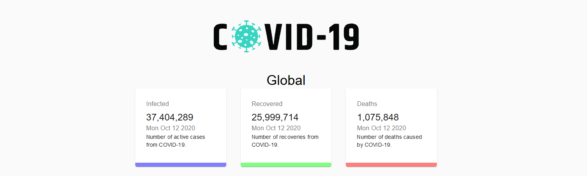
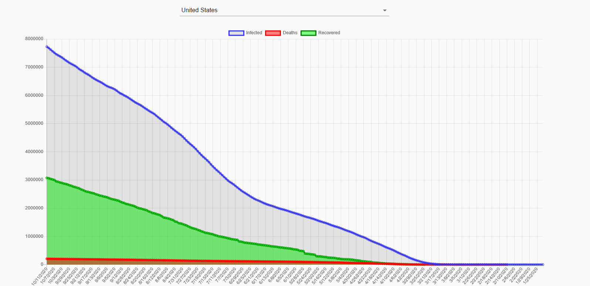

# COVID-19 Tracker

The project uses an api from 'https://covid19.mathdro.id/api' to render the total number of COVID19 cases globally as well
as in individual countries using Charts. The COVID-19 pandemic has struck the world fiercely so this is my small contribution to this cause. Hopefully somebody finds this project useful.

Thank You.

Link to the app: [COVID-19 Tracker](https://covid-19-tracker-dashboard.netlify.app/)

Overview
This project is a COVID-19 Tracker built using React. It provides real-time data on COVID-19 cases, recoveries, and deaths worldwide, with the ability to filter by country. The data is fetched from a reliable API, and the app offers a clean interface for users to visualize the latest statistics using charts and maps.

Features
Global COVID-19 Data: Displays total confirmed cases, active cases, recoveries, and deaths.
Country-Specific Data: Allows users to view COVID-19 data by selecting a specific country.
Interactive Charts: Visualizes data trends using charts (e.g., line graphs, bar charts).
Map View: Shows a world map highlighting affected areas and the intensity of cases.
Responsive Design: The app is optimized for mobile, tablet, and desktop devices.
